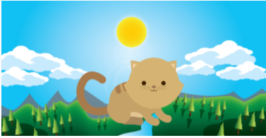
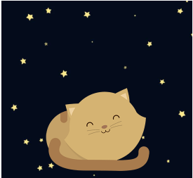
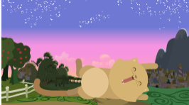

#Reto de Codigo - 1. KITTEN
Crea una página web donde se muestre un paisaje y un gatito diferente a medida que la ventana del navegador se haga más pequeña.

El primer reto encontrado en este primer ejercicio fue el de la creación de la estructura html para despues darle estilos a las clases creadas en los elementos de la estructura html.

Se tomo como base un grid.css para colocarle algunas clases existentes a  uestros elementos.

Por ultimo la creacion de los medias para configurar la visualización de las imagenes dependiendo del tamaño de la pantalla.

Con esto se logro el primer reto.
